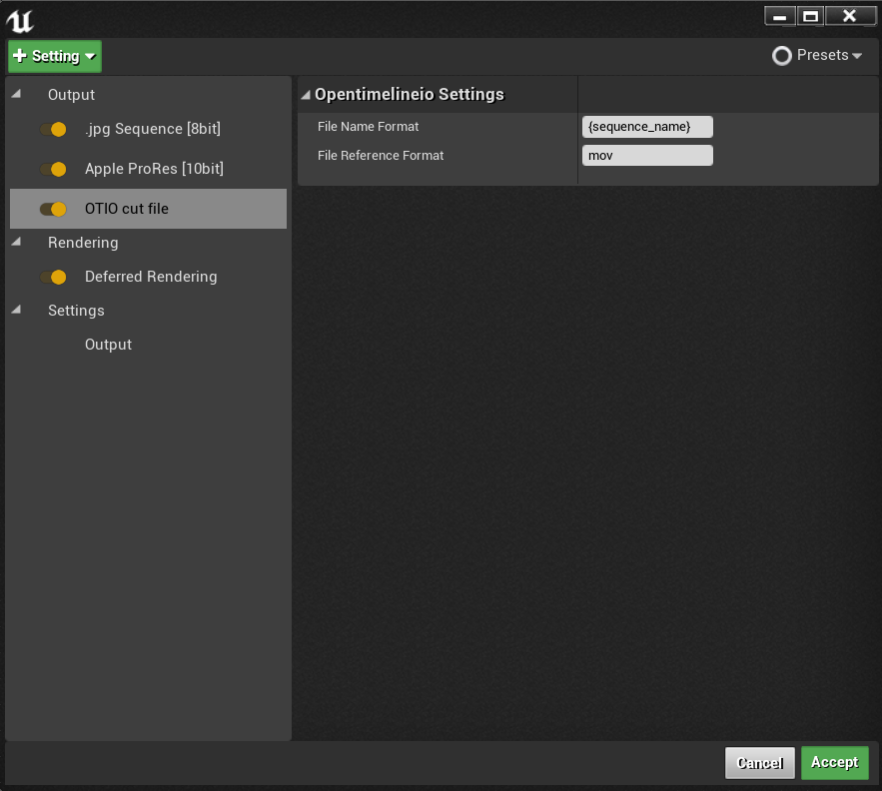
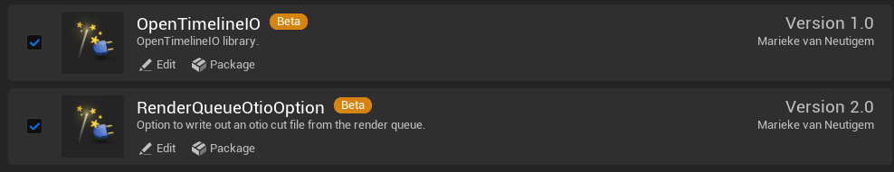

# UnrealOtioExporter
Otio exporter option, plugin for the movie render queue.
Currently only windows is supported, but could easily be extended if you compile opentimelineio for your target platform and add the dependencies.

## Unreal Engine 5 Release

There has unfortunately been some regression in functionality with the port from Unreal 4 to Unreal 5.

Bug report Case # 00618138

The FMovieSceneExportMetadataShot objects in the FMovieSceneExportMetadata no longer contain MovieSceneShotSection info, the attribute it still there but it is a nullptr.
This is due to the changes made here:

https://github.com/EpicGames/UnrealEngine/blob/5.3/Engine/Plugins/MovieScene/MovieRenderPipeline/Source/MovieRenderPipelineCore/Private/MoviePipeline.cpp#L261-L274

This means we no longer have any way of mapping which clip in the metadata corresponds to which section in the master sequence.

For now the functionality in the Unreal 5 version of the OTIO export setting mirrors the FCPXML plugin when the "OutputMetadata" option is selected.
With exception that it lays out the clips sequantially on the timeline rather than stacked.

Additionally the plugin has now been split in two; 
- OpenTimelineIO
- RenderQueueOtioOption
So if you'd like to use the OpenTimelineIO porton you can simply only use that plugin and exclude the RenderQueueOtioOption.
The OpenTimelineIO plugin contains the compiled libraries from the main branch up to commit hash eaf8569c1bdbea8bff568f063acb5318db9b7d15.
